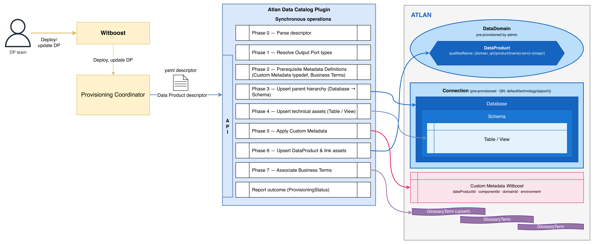
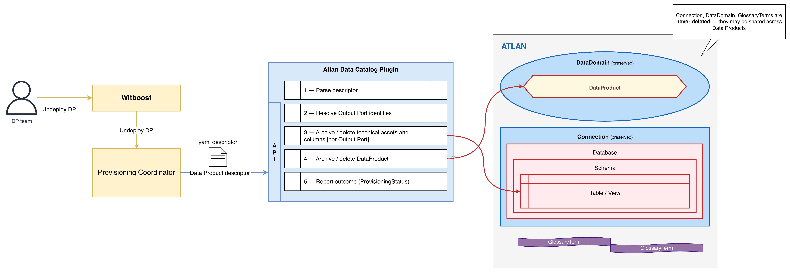

# High Level Design

This document describes the High Level Design of the Atlan Data Catalog Plugin for Witboost.
The source diagrams can be found and edited in the [accompanying draw.io file](drawio-diagrams/hld.drawio).

- [Overview](#overview)
- [Technology Stack](#technology-stack)
- [Provisioning](#provisioning)
  - [Provisioning Flow](#provisioning-flow)
- [Unprovisioning](#unprovisioning)
- [Validation](#validation)
- [Idempotency](#idempotency)
- [Error Handling](#error-handling)

## Overview

### Data Catalog Plugin

A Data Catalog Plugin is a service in charge of publishing a Data Product onto a Data Catalog as part of the provisioning process on Witboost.

The Data Catalog Plugin is invoked by an upstream service of the Witboost platform, namely the Coordinator,  which is in charge of orchestrating the creation of a complex infrastructure by coordinating all the Data Product resource provisioning tasks performed by Tech Adapters (also known as Specific Provisioners) in a single workflow. The Data Catalog Plugin is called after all the Tech Adapters have successfully deployed their resources and receives a _Data Product descriptor_ as input with all the components of said Data Product, including any extra information that the Tech Adapters have returned as output of their operations.

You can learn more about how Data Catalog Plugins fit in the broader picture [here](https://docs.witboost.com/docs/p2_arch/p6_other_modules/p6_2_dataCatalog).

The plugin exposes an API conforming to the [Witboost Data Catalog Plugin API](https://docs.witboost.com/docs/apis/extension-points/market-plane/data-catalog-plugin-api):

| Operation | Endpoint | Description |
| --- | --- | --- |
| **validate** | `POST /v1/validate` | Checks if the provided resource descriptor conforms to the expected structure and has all the necessary information to be deployed on the infrastructure |
| **provision** | `POST /v1/provision` | Publishes metadata to the data catalog |
| **unprovision** | `POST /v1/unprovision` | Removes the metadata of a system or a single component from the data catalog |
| **entity reference** | `GET /v1/entity/reference?componentId=...` | Returns the reference (id, links, etc) to the Data Catalog entity that refers to the provided Output Port |

Key differences from a Tech Adapter:

- The plugin receives the **full Data Product descriptor** enriched with all Tech Adapters' provisioning results
- It operates **after** all Tech Adapters have completed
- It returns `publicInfo` / `privateInfo` keyed by **component ID** (see [Info structure](https://docs.witboost.com/docs/p2_arch/p6_other_modules/p6_2_dataCatalog/#info-structure))

### Atlan Data Catalog Plugin

This plugin synchronizes Witboost Data Product metadata into [Atlan](https://atlan.com). On each provisioning event, it maps the Data Product descriptor into Atlan entities (DataProduct, Table/View, Column, Glossary Terms) and publishes them via the Atlan SDK.

The plugin is **technology-agnostic by design**: it uses an Output Port Resolver pattern to encapsulate technology-specific knowledge (e.g., how to derive the Atlan asset identity from technology-specific fields). The initially supported technology is **Databricks** (Unity Catalog). Other technologies (e.g., Snowflake, BigQuery) can be added by implementing a new resolver — without modifying the core provisioning flow.

The plugin communicates exclusively with the **Atlan API** (authenticated via OAuth 2.0 Client Credentials Grant, using a client ID/secret scoped to a Persona) and performs:

- Technical asset (Table/View) creation or update for each Output Port
- DataProduct creation/update in Atlan (linked to technical assets via asset selection DSL)
- Column synchronization from the Data Contract schema
- Custom Metadata application (`Witboost` metadata, 9 attributes across DataProduct/Table/View/Column — see [Custom Metadata](#custom-metadata))
- Business Term upsert and association

Key architectural invariant: **the plugin never modifies data platform resources**. It only reads the descriptor and writes metadata to Atlan.

### Pre-requisites (Infrastructure)

| Component | Requirement                                                                                                                                                                                                                                                                                                                                                                                                                                                                                                                                                                                                                                                                                                                                                                                                                                                                                                                                                                                                                                                  |
| --- |--------------------------------------------------------------------------------------------------------------------------------------------------------------------------------------------------------------------------------------------------------------------------------------------------------------------------------------------------------------------------------------------------------------------------------------------------------------------------------------------------------------------------------------------------------------------------------------------------------------------------------------------------------------------------------------------------------------------------------------------------------------------------------------------------------------------------------------------------------------------------------------------------------------------------------------------------------------------------------------------------------------------------------------------------------------|
| Atlan Connection | Pre-configured in Atlan for each target data platform and environment (e.g., one Databricks Connection for production, one for development). The plugin resolves assets under these Connections                                                                                                                                                                                                                                                                                                                                                                                                                                                                                                                                                                                                                                                                                                                                                                                                                                                              |
| Atlan DataDomain | Pre-configured in Atlan for each Witboost domain. The `qualifiedName` of a top-level domain equals its name (e.g., `finance`). The plugin links DataProducts to the appropriate domain                                                                                                                                                                                                                                                                                                                                                                                                                                                                                                                                                                                                                                                                                                                                                                                                                                                                       |
| Atlan credential | Access is granted through an **OAuth 2.0 Client Credentials Grant** — the plugin holds a `client_id` + `client_secret` pair. |
| Glossary | Pre-configured in Atlan (shared or per-domain), or the plugin can create it if configured to do so                                                                                                                                                                                                                                                                                                                                                                                                                                                                                                                                                                                                                                                                                                                                                                                                                                                                                                                                                           |
| Custom Metadata type | The plugin creates the `Witboost` Custom Metadata type automatically at startup if it does not exist. **Attributes must be created before any asset that carries them** (see [Provisioning Flow](#provisioning-flow)), and are addressed by their Atlan-generated 22-character attribute ids, never by display name — see [Custom Metadata](#custom-metadata)                                                                                                                                                                                                                                                                                                                                                                                                                                                                                                                                                                                                                                                                                      |

## Technology Stack

- **Python ~3.11** — service runtime
- **FastAPI** — HTTP framework, dependency injection, and automatic OpenAPI specification
- **pyatlan SDK** — official Atlan API client
- **Poetry** — dependency management and packaging

### Internal Component Structure

```text
Provisioning Service
        │
        ├── Descriptor Parser        → Validates and models the incoming DP descriptor
        ├── Output Port Resolver     → Resolves each OP to an Atlan asset type + identity
        │     Registry                  (technology-specific: Databricks, future Snowflake, etc.)
        ├── Column Mapper            → Maps Data Contract schema to Atlan Columns
        ├── Glossary Mapper          → Maps business term references to Atlan GlossaryTerms
        │
        ├── Asset Service            → CRUD for technical assets (Table, View, Column)
        ├── DataProduct Service      → CRUD for Atlan DataProduct + asset linking
        ├── Glossary Service         → CRUD for glossary terms + associations
        ├── Custom Metadata Service  → Create/update Witboost metadata on assets
        └── Atlan Client             → Wraps the Atlan SDK (auth, retries, error mapping)
```

For the full module-level breakdown and source layout see [Technical Details](technical-details.md#module-layout).

## Provisioning



The plugin receives the **full Data Product descriptor** from Witboost, already enriched with provisioning results from all Tech Adapters. It processes the entire Data Product and all its Output Ports in a single invocation.

### Provisioning Flow

The provisioning executes the following phases sequentially. Each phase must succeed for the next to begin. On any failure, the plugin returns a `FAILED` status with diagnostic detail.

| Phase | Name | Description |
| --- | --- | --- |
| 0 | Descriptor Parsing | Parse the enriched DP descriptor; extract Data Product metadata and all Output Ports |
| 1 | Output Port Resolution | For each Output Port: select the appropriate resolver, compute the Atlan asset type and `qualifiedName` |
| 2 | Prerequisite Metadata Definitions | Ensure the `Witboost` Custom Metadata typedef exists; ensure/create every Business Term (glossary term) referenced via `tags` `tagFQN` paths in the descriptor. Must run before any carrier asset (Table/View/Column/DataProduct) is created |
| 3 | Parent Hierarchy Upsert | Ensure the asset's parent hierarchy exists in Atlan (Database → Schema) |
| 4 | Technical Asset Upsert | Create or update the technical asset (Table/View) in Atlan; reconcile columns |
| 5 | Apply Custom Metadata | Apply `Witboost` Custom Metadata values to managed assets (Table, View, Column) by attribute id (see [Custom Metadata](#custom-metadata)) |
| 6 | DataProduct Upsert & Linking | Create or update the Atlan `DataProduct` entity under the configured `DataDomain`; re-assert the full asset selection DSL via the SDK on every push; set `daapOutputPortGuids`; apply `Witboost` Custom Metadata to the DataProduct |
| 7 | Associate Business Terms | Associate the terms ensured in Phase 2 to assets and/or columns via `assignedTerms` |

**Important**: Technical assets are created **before** the DataProduct (Phase 4 before
Phase 6). This is required because the Atlan DataProduct uses an asset selection DSL
(a search query) and `daapOutputPortGuids` (Atlan GUIDs) to reference its assets — the
assets must exist in Atlan before they can be linked to the DataProduct.

**Critical, silent-failure invariants** — none
of these are enforced or warned about by the Atlan API itself, so the plugin must
enforce them:

- **Asset selection DSL must be rebuilt via the SDK on every push, not hand-crafted.**
  Data Product membership is fundamentally a *stored search* (a nested boolean DSL
  query), not a fixed GUID list. Saving the Atlan UI's Edit-assets modal silently
  rewrites an SDK-authored DSL into a frozen GUID list, freezing the selection so it
  stops being live. Because **Witboost is the system of record**, the plugin must
  **re-assert the full asset selection DSL through the pyatlan SDK's query-builder
  constructs on every `provision` call** — even when the DataProduct already exists —
  never by hand-editing JSON, and never by trusting whatever selection is currently
  stored in Atlan. See [Atlan's own how-to](https://docs.atlan.com/product/capabilities/build-apps/sdks/python/data-mesh/how-tos/manage-data-products).
- **`daapOutputPortGuids` sits on top of the asset selection, not instead of it.** An
  output port GUID present in `daapOutputPortGuids` but **not** matched by the asset
  selection DSL will not render in the DataProduct UI, and Atlan gives **no error or
  warning**. The plugin must guarantee the DSL it builds always matches at least the
  same set of assets referenced in `daapOutputPortGuids` for that push.
- **Never set `daapInputPortGuids`.** It is technically writable, but Atlan derives it
  automatically from other Data Products' output ports. The plugin must not set or
  overwrite it.

On success, the plugin returns `publicInfo` keyed by component ID, including links to the Atlan entities:

```json
{
  "status": "COMPLETED",
  "info": {
    "publicInfo": {
      "urn:dmb:cmp:finance:cashflow:0:orders-output-port": {
        "atlanLink": {
          "type": "string",
          "label": "View in Atlan",
          "value": "orders",
          "href": "https://tenant.atlan.com/assets/..."
        }
      }
    }
  }
}
```

For detailed API-level interactions and the full resolver design, see the [Technical Details](technical-details.md).

### Entity Mapping

| Witboost Concept | Atlan Entity | Identity (`qualifiedName`) | Managed By |
| --- | --- | --- | --- |
| Domain | DataDomain | `{domain_name}` (e.g., `finance`) | Pre-provisioned by admin |
| Data Product | DataProduct | `{domain_qn}/product/{normalized_name}-{env}-v{major}` (e.g., `finance/product/risk-finance-production-v0`) | Plugin (upsert) |
| Output Port | Table / View (resolved by technology) | Technology-native: `{connection_qn}/{catalog}/{schema}/{object}` | Plugin (upsert or reuse existing) |
| Column | Column | `{asset_qn}/{column_name}` | Plugin (upsert) |
| Business Term | GlossaryTerm | `{glossary_qn}/{term_name}` | Plugin (upsert or reuse) |
| Connection | Connection | `default/{connector_type}/{epoch}` (e.g., `default/databricks/1692345678`) | Pre-provisioned by admin |
| Witboost metadata | Custom Metadata (`Witboost`) | N/A — applied as attributes on DataProduct, Table, View, and Column | Plugin (create type + apply) |

### Output Port Resolver Pattern

The plugin uses a **resolver registry** to encapsulate all technology-specific logic. For each Output Port, the registry selects the appropriate resolver based on the `technology` field:

- **Databricks Resolver** — extracts `catalogName`, `schemaName`, `tableName` from `specific.*`; constructs the Atlan `qualifiedName` under the configured Databricks Connection
- **Future resolvers** (e.g., Snowflake, BigQuery) — new technologies are added by implementing a single resolver interface, with no changes to the core provisioning flow

### Connection Model

Connections represent the technical source/instance in Atlan and are **shared infrastructure**. They are pre-provisioned by an Atlan admin and referenced in the plugin configuration by technology and environment.

The Connection is the root of the technical asset hierarchy:

```text
Connection
└── Database (Catalog)
    └── Schema
        └── Table / View
            └── Column
```

The Connection is **not** part of the Data Product model. The Data Product links to technical assets via Atlan's asset selection mechanism.

### Identity Strategy

All asset identity in Atlan is based on **`typeName` + `qualifiedName`**. The plugin never stores Atlan GUIDs, making it **stateless** — no local database of ID mappings is needed.

- `qualifiedName` is **deterministic**: computable from the descriptor without querying Atlan first
- Upserting with the same `qualifiedName` updates the existing asset
- If an asset already exists in Atlan (e.g., crawled by a native connector), the plugin **reuses** it

#### Data Product Identity

The DataProduct identity is derived from the Witboost Data Product ID, environment, and major version:

```text
{domain_qualified_name}/product/{normalized_dp_name}-{environment}-v{major_version}
```

Example for `urn:dmb:dp:finance:risk-finance:0` deployed in `production`:

| Witboost field | Value |
| --- | --- |
| Data Product ID | `urn:dmb:dp:finance:risk-finance:0` |
| Domain | `finance` |
| Environment | `production` |
| Display name | `Risk Finance` |
| **Atlan qualifiedName** | **`finance/product/risk-finance-production-v0`** |
| **Atlan display name** | **`Risk Finance-v0`** |

This encoding ensures:

- **Stable identity**: derived from the Witboost ID, not the display name
- **Environment isolation**: the same DP deployed in `production` and `development` produces two distinct DataProducts on the same Atlan tenant
- **Version coexistence**: major versions `v0` and `v1` can coexist as separate DataProducts
- **Idempotency**: re-provisioning the same DP + environment + version always maps to the same identity

The Witboost Data Product ID is also stored as Custom Metadata on the DataProduct for full traceability.

#### Technical Asset Identity

Technical assets use the platform-native identity convention under the Connection:

| Technology | qualifiedName pattern | Example |
| --- | --- | --- |
| Databricks | `{connectionQN}/{catalogNameOP}/{schemaNameOP}/{viewNameOP}`  | `default/databricks/1692345678/risk-finance/orders-output-port/orders_view` |

The Witboost Component ID is stored as Custom Metadata on the technical asset.

### Custom Metadata

The plugin uses Atlan Custom Metadata to maintain Witboost traceability on managed assets. The Custom Metadata type `Witboost` is created automatically by the plugin at startup if it does not exist.

| Attribute            | Applies to                     | Description                                                                       |
|----------------------|--------------------------------|-----------------------------------------------------------------------------------|
| Data Product URN     | DataProduct                    | Witboost Data Product ID (e.g. `urn:dmb:dp:...`)                                  |
| Data Product Version | DataProduct                    | Full Witboost Data Product version                                                |
| Domain               | DataProduct, Table, View, Column | Witboost Domain ID                                                                |
| Environment          | DataProduct, Table, View, Column | Deployment environment                                                            |
| Output Port URN      | Table, View, Column            | Witboost Component ID of the Output Port (e.g. `urn:dmb:cmp:...`)                 |
| Data Product Owner   | DataProduct                    | Witboost Data Product owner                                                       |
| Dev Group            | DataProduct                    | Witboost dev group                                                                |
| Witboost Link        | DataProduct, Table, View | Deep link back to the entity in the Witboost Marketplace                          |
| Last Synced At       | DataProduct, Table, View, Column | Timestamp of the last successful provisioning sync — supports staleness detection |

**Critical implementation constraint**: Atlan addresses custom metadata attributes by
their **generated 22-character attribute id** (e.g. `K1q8knpp3YZYocUFuRDj6r`), never by
display name. A write keyed by display name is **silently ignored** — Atlan returns no
error, the value simply does not apply. The plugin must:

1. Resolve each attribute's generated id at startup (or on first use) by reading the
   `Witboost` typedef back from Atlan and matching on display name, then cache the
   `{display_name: attribute_id}` mapping for the process lifetime — the actual ids are
   **tenant-specific** and must never be hardcoded in source.
2. After writing custom metadata to an asset, **read the value back** to confirm it was
   actually applied, at least during initial integration testing against a new tenant.

This is the same class of silent-failure risk as the asset selection DSL / `daapOutputPortGuids`
mismatch described in [Provisioning Flow](#provisioning-flow) — the Atlan API does not
warn when a write is misdirected; the plugin is responsible for its own correctness
verification.

**Standard Atlan fields used directly:**

| Witboost field | Atlan native field | Entity |
| --- | --- | --- |
| Data Product owner | `owner_users` / `owner_groups` | DataProduct, Table/View |
| Description | `description` | DataProduct, Table/View, Column |
| Data Product name | `name` | DataProduct |

## Unprovisioning



Unprovisioning removes the metadata created by the plugin for a given Data Product. The operation is idempotent and does not fail if assets are already missing.

The main operations are:

- For each Output Port in the descriptor: archive or delete its technical asset (Table/View) and columns
- Archive or delete the DataProduct itself, once every Output Port has been processed (skipped only if it was never created)

The following entities are **never deleted** during unprovisioning, as they are shared infrastructure:

- Connection
- DataDomain
- Business Terms (may be referenced by other Data Products)

The unprovision strategy is configurable:

| Strategy | Behavior | Recovery | Use Case |
| --- | --- | --- | --- |
| **Archive** (default) | Marks the asset as deleted in Atlan. The asset is hidden from the UI but remains in the backend | Reversible — an admin can restore the asset | Safe removal |
| **Purge** | Permanently erases the asset from Atlan's storage, including all metadata and relationships | Irreversible | Permanent clean-up of stale assets, compliance-driven data removal |

## Validation

`POST /v1/validate` returns a `ValidationResult` synchronously. The operation is pure and bounded — it performs descriptor-only checks with no Atlan API calls and no side effects.

| Check | Detail |
| --- | --- |
| Descriptor structure | Valid YAML, required top-level fields present |
| Data Product fields | Name, domain, version, owner present |
| Output Ports | At least one Output Port with a supported `technology` |
| Output Port metadata | Each OP has valid table metadata in `specific.*` |
| Data Contract | Each OP has a `dataContract.schema` with at least one column |
| Business Terms | Referenced terms are syntactically valid |

## Update Access Control List

`POST /v1/updateacl` is **not applicable** for this Data Catalog Plugin: it does not act as an access-control system for the underlying platform. Asset ownership (`owner_users`/`owner_groups`) is derived from the descriptor and applied as part of provisioning/unprovisioning, not through an independent ACL lifecycle. Atlan's native access controls govern read access to the synchronized metadata. The endpoint always reports a successful no-op rather than an error, since no ACL reconciliation is expected to happen here.

## Idempotency

The plugin is designed so that re-provisioning the same Data Product produces the same result without duplications. This is achieved through deterministic identity construction:

| Entity | Strategy |
| --- | --- |
| DataProduct | Upsert by identity derived from Witboost DP ID, environment, and major version |
| Technical asset | Upsert by platform-native asset identity |
| Columns | Reconcile: add new, update changed, archive removed |
| Business Terms | Reuse existing terms; create only if not found |
| Custom Metadata | Apply idempotently (overwrite on each provision) |

No local state is needed. The descriptor alone is sufficient to compute all identities.

## Error Handling

The plugin classifies errors into the following categories:

| Category | Examples | Behavior |
| --- | --- | --- |
| **Descriptor validation** | Invalid YAML, missing fields, unsupported technology | FAILED at validation, before any Atlan API call |
| **Identity resolution** | Resolver cannot compute asset identity from descriptor content | FAILED with diagnostic detail |
| **Atlan API 4xx** | Permission denied, not found, conflict | FAILED immediately — non-retryable |
| **Atlan API 5xx / transient errors** | Server error, timeout, eventual-consistency lookup misses | FAILED immediately, except for the Business Term association step (Phase 7), which retries with exponential backoff before failing |
| **Partial failure** | Some Output Ports succeed, others fail | No rollback — report which steps succeeded/failed; ask the user to re-provision the Data Product |

For the full error code list and retry configuration, see the [Technical Details](technical-details.md).
